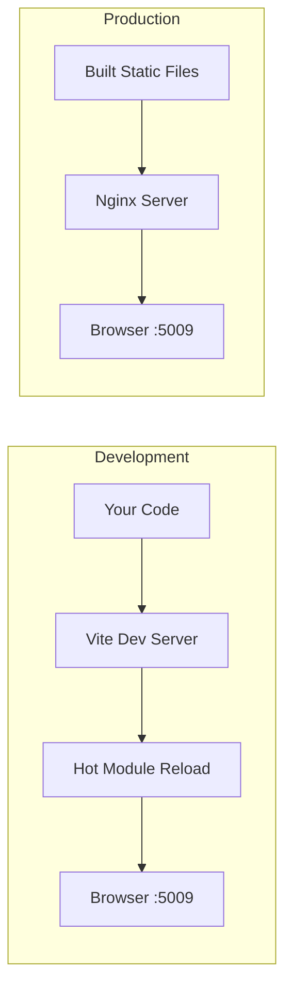
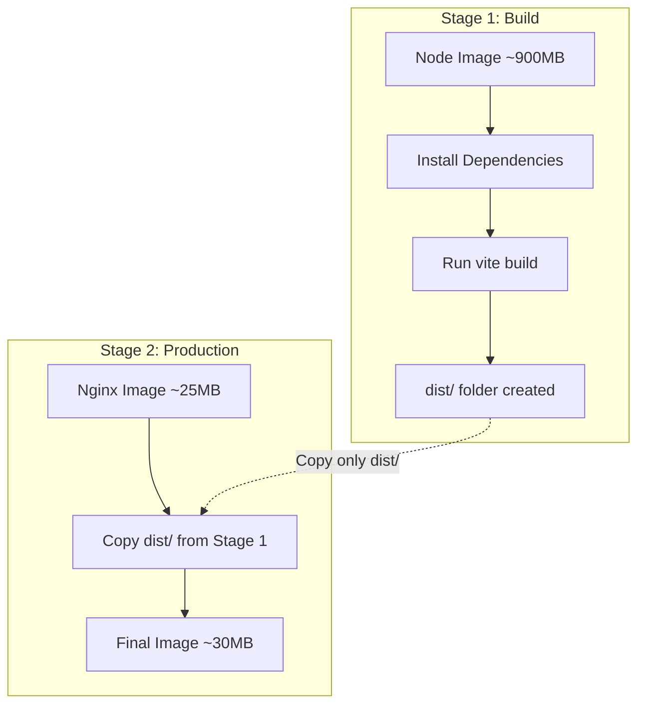
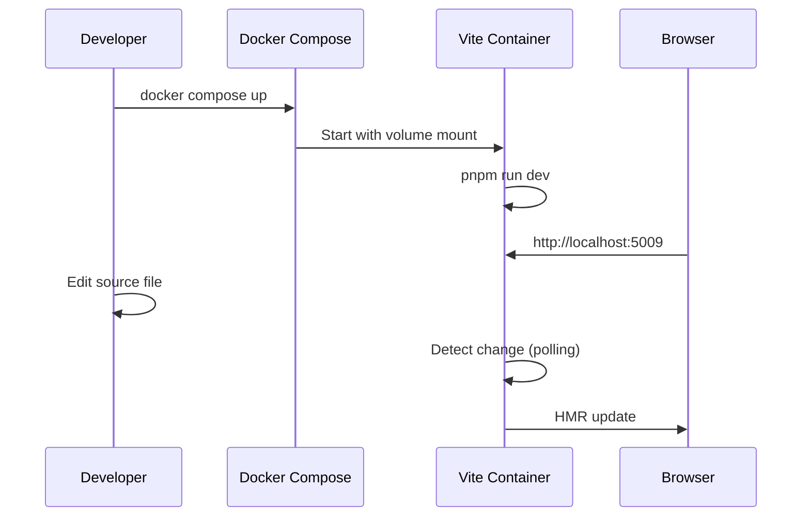
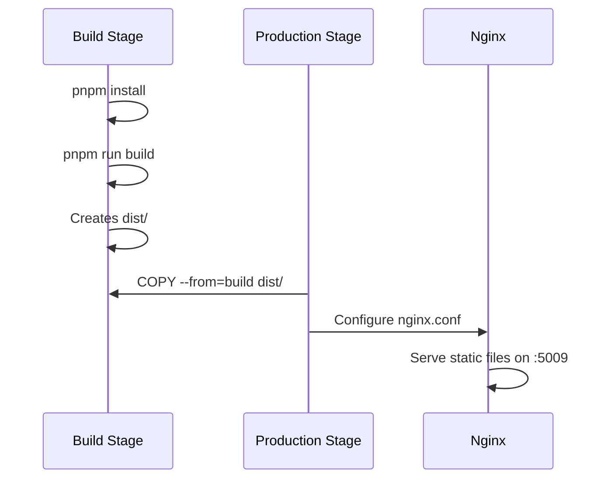

# Docker Setup Guide for Vite + React (Dev to Production)

This guide explains how to Dockerize your Vite React application for **development first**, then **production with nginx**, exposing **port 5009**.

---

## Understanding the Architecture



### Why Two Different Approaches?

| Aspect | Development | Production |
|--------|-------------|------------|
| **Server** | Vite Dev Server | Nginx |
| **Purpose** | Hot reload, fast feedback | Optimized static file serving |
| **Build** | No build needed | `vite build` required |
| **Performance** | Not optimized | Gzipped, cached, fast |
| **File Size** | Large (source + deps) | Small (minified bundle) |

---

## Step 1: Update [vite.config.ts](file:///Users/kartikdevarde/Developer/food_nutrition/food_nutrition_web/vite.config.ts) for Docker Compatibility

### WHY?
By default, Vite dev server only listens on `localhost` (127.0.0.1). Inside Docker, this means the container can't receive external connections. We need to tell Vite to listen on `0.0.0.0` (all network interfaces).

### WHAT TO ADD:

```typescript
// vite.config.ts
import path from 'path'
import { defineConfig } from 'vite'
import react from '@vitejs/plugin-react-swc'
import tailwindcss from '@tailwindcss/vite'
import { tanstackRouter } from '@tanstack/router-plugin/vite'

export default defineConfig({
  plugins: [
    tanstackRouter({
      target: 'react',
      autoCodeSplitting: true,
    }),
    react(),
    tailwindcss(),
  ],
  resolve: {
    alias: {
      '@': path.resolve(__dirname, './src'),
    },
  },
  // ✅ ADD THIS SECTION
  server: {
    host: '0.0.0.0',  // Listen on all interfaces (required for Docker)
    port: 5009,       // Your desired port
    strictPort: true, // Fail if port is already in use
    watch: {
      usePolling: true, // Required for file watching in Docker
    },
  },
  preview: {
    host: '0.0.0.0',
    port: 5009,
  },
})
```

### EXPLANATION:
- `host: '0.0.0.0'` - Makes the server accessible from outside the container
- `port: 5009` - Uses your specified port
- `strictPort: true` - Ensures consistent port usage
- `usePolling: true` - Docker's filesystem events don't always propagate, polling ensures file changes are detected

---

## Step 2: Create Development Dockerfile

### WHY?
Development Dockerfile focuses on:
1. **Fast rebuilds** - Using layer caching for dependencies
2. **Hot Module Reload** - Keeping source files in sync
3. **Volume mounting** - Your local code changes reflect immediately

### CREATE: `Dockerfile.dev`

```dockerfile
# ============================================
# DEVELOPMENT DOCKERFILE
# ============================================

# WHY node:22-alpine?
# - Alpine is small (~50MB vs ~900MB for full Node)
# - Node 22 supports modern JavaScript features
# - LTS version = stable
FROM node:22-alpine

# WHY set WORKDIR?
# - Creates a dedicated directory for your app
# - All subsequent commands run from here
# - Keeps container filesystem organized
WORKDIR /app

# WHY install pnpm globally?
# - Your project uses pnpm (pnpm-lock.yaml exists)
# - Alpine doesn't have pnpm by default
RUN npm install -g pnpm

# WHY copy package files first?
# - Docker caches each layer
# - If package.json hasn't changed, Docker reuses cached deps
# - This makes rebuilds MUCH faster
COPY package.json pnpm-lock.yaml ./

# WHY separate install step?
# - Cached layer = dependencies don't reinstall on every code change
# - Saves minutes on each rebuild
RUN pnpm install

# WHY NOT copy source files here?
# - In development, we mount source as a volume
# - This allows hot reload without rebuilding the image

# WHY EXPOSE?
# - Documents which port the container listens on
# - Doesn't actually publish the port (that's -p flag's job)
EXPOSE 5009

# WHY use dev command?
# - Starts Vite's development server with HMR
CMD ["pnpm", "run", "dev"]
```

---

## Step 3: Create Docker Compose for Development

### WHY Docker Compose?
- Simplifies running containers with many options
- Reproducible across machines
- Can add more services later (database, API, etc.)

### CREATE: `docker-compose.dev.yml`

```yaml
# docker-compose.dev.yml
version: '3.8'

services:
  web:
    # WHY build context?
    # - Tells Docker where to find Dockerfile and source files
    build:
      context: .
      dockerfile: Dockerfile.dev
    
    # WHY these ports?
    # - Maps host:container ports
    # - You access http://localhost:5009 on your machine
    ports:
      - "5009:5009"
    
    # WHY volumes?
    # This is the KEY to development workflow:
    volumes:
      # Mount source code - changes reflect instantly
      - .:/app
      # Anonymous volume for node_modules
      # WHY? Prevents host's node_modules from overriding container's
      - /app/node_modules
    
    # WHY environment variables?
    # - CHOKIDAR_USEPOLLING: Alternative to usePolling in vite config
    # - WATCHPACK_POLLING: For webpack-based tools if needed
    environment:
      - CHOKIDAR_USEPOLLING=true
      - WATCHPACK_POLLING=true
    
    # WHY stdin_open and tty?
    # - Keeps container running interactively
    # - Allows you to see logs in real-time
    stdin_open: true
    tty: true
```

---

## Step 4: Create Production Dockerfile (Multi-Stage Build)

### WHY Multi-Stage Build?


Benefits:
- **Tiny final image** (~30MB vs ~1GB)
- **No Node.js in production** - just static files + nginx
- **Secure** - no build tools, source code, or dev dependencies exposed

### CREATE: `Dockerfile`

```dockerfile
# ============================================
# PRODUCTION DOCKERFILE (Multi-Stage Build)
# ============================================

# ------------------- STAGE 1: BUILD -------------------
# WHY "AS build"?
# - Names this stage so we can reference it later
FROM node:22-alpine AS build

WORKDIR /app

# WHY install pnpm?
# - Required to install dependencies
RUN npm install -g pnpm

# WHY copy package files first?
# - Layer caching optimization (same as development)
COPY package.json pnpm-lock.yaml ./

# WHY --frozen-lockfile?
# - Ensures exact versions from lockfile are installed
# - Fails if lockfile is out of sync (catches errors)
RUN pnpm install --frozen-lockfile

# NOW copy all source files
# WHY after dependencies?
# - Source code changes frequently
# - Dependencies change rarely
# - This order maximizes cache hits
COPY . .

# WHY run build?
# - Creates optimized production bundle in /app/dist
# - Minified, tree-shaken, code-split
RUN pnpm run build

# ------------------- STAGE 2: PRODUCTION -------------------
# WHY nginx:alpine?
# - Nginx is the gold standard for serving static files
# - Alpine variant is tiny (~25MB)
# - Handles gzip, caching, routing efficiently
FROM nginx:alpine AS production

# WHY remove default nginx files?
# - Clean slate for our application
RUN rm -rf /usr/share/nginx/html/*

# WHY copy from build stage?
# - ONLY copies the dist/ folder (built files)
# - Discards Node.js, source code, node_modules
# - Massive size reduction
COPY --from=build /app/dist /usr/share/nginx/html

# WHY copy custom nginx config?
# - Need to configure SPA routing
# - Set up port 5009
# - Enable gzip compression
COPY nginx.conf /etc/nginx/conf.d/default.conf

# EXPOSE the port
EXPOSE 5009

# WHY this command?
# - Runs nginx in foreground (required for Docker)
# - "daemon off" prevents nginx from backgrounding itself
CMD ["nginx", "-g", "daemon off;"]
```

---

## Step 5: Create Nginx Configuration

### WHY Custom Nginx Config?
1. **SPA Routing** - React Router needs all routes to serve index.html
2. **Custom Port** - Use 5009 instead of default 80
3. **Performance** - Enable gzip compression
4. **Caching** - Cache static assets for speed

### CREATE: `nginx.conf`

```nginx
# nginx.conf

server {
    # WHY port 5009?
    # - Your specified port
    # - Must match EXPOSE in Dockerfile
    listen 5009;
    listen [::]:5009;  # IPv6 support

    # WHY this root?
    # - Where we copied dist/ files in Dockerfile
    root /usr/share/nginx/html;
    
    # WHY index.html?
    # - Entry point for SPA
    index index.html;

    # ============ GZIP COMPRESSION ============
    # WHY gzip?
    # - Reduces file sizes by 60-80%
    # - Faster load times
    # - Less bandwidth usage
    gzip on;
    gzip_vary on;
    gzip_min_length 1024;
    gzip_proxied any;
    gzip_types
        text/plain
        text/css
        text/javascript
        application/javascript
        application/json
        application/xml
        image/svg+xml;

    # ============ STATIC FILE CACHING ============
    # WHY cache assets?
    # - Vite adds content hashes to filenames (main.a1b2c3.js)
    # - Safe to cache forever - filename changes when content changes
    location ~* \.(js|css|png|jpg|jpeg|gif|ico|svg|woff|woff2|ttf|eot)$ {
        expires 1y;
        add_header Cache-Control "public, immutable";
    }

    # ============ SPA ROUTING ============
    # WHY try_files?
    # - First tries to serve the exact file requested
    # - If not found, serves index.html
    # - This is CRITICAL for client-side routing to work
    #
    # WITHOUT THIS: /dashboard returns 404
    # WITH THIS: /dashboard serves index.html, React Router handles it
    location / {
        try_files $uri $uri/ /index.html;
    }

    # ============ SECURITY HEADERS ============
    # WHY these headers?
    # - Protect against common web vulnerabilities
    add_header X-Frame-Options "SAMEORIGIN" always;
    add_header X-Content-Type-Options "nosniff" always;
    add_header X-XSS-Protection "1; mode=block" always;
}
```

---

## Step 6: Create Production Docker Compose

### CREATE: `docker-compose.yml`

```yaml
# docker-compose.yml (Production)
version: '3.8'

services:
  web:
    build:
      context: .
      dockerfile: Dockerfile
      # WHY target?
      # - Specifies which stage to build up to
      target: production
    
    ports:
      - "5009:5009"
    
    # WHY restart policy?
    # - Automatically restarts if container crashes
    # - "unless-stopped" = restarts unless you manually stop it
    restart: unless-stopped

    # WHY healthcheck?
    # - Monitors if nginx is actually responding
    # - Docker can restart unhealthy containers
    healthcheck:
      test: ["CMD", "wget", "--quiet", "--tries=1", "--spider", "http://localhost:5009"]
      interval: 30s
      timeout: 10s
      retries: 3
      start_period: 10s
```

---

## Step 7: Create `.dockerignore`

### WHY .dockerignore?
- Prevents copying unnecessary files into the Docker build context
- Faster builds (less data to send to Docker daemon)
- Smaller images (no dev files)
- Security (no sensitive files like .env)

### CREATE: `.dockerignore`

```gitignore
# Dependencies
node_modules

# Build output (we build inside Docker)
dist

# Development files
.git
.gitignore
*.md
!README.md

# IDE
.idea
.vscode
*.swp
*.swo

# Environment files (add via Docker secrets or env vars)
.env
.env.*

# Testing
coverage
*.test.ts
*.spec.ts

# OS files
.DS_Store
Thumbs.db

# Docker files (prevent recursive copying)
Dockerfile*
docker-compose*.yml
```

---

## Usage Commands

### Development Mode

```bash
# Build and start development container
docker compose -f docker-compose.dev.yml up --build

# Start in background
docker compose -f docker-compose.dev.yml up -d

# View logs
docker compose -f docker-compose.dev.yml logs -f

# Stop
docker compose -f docker-compose.dev.yml down
```

### Production Mode

```bash
# Build production image
docker compose build

# Start production container
docker compose up -d

# View logs
docker compose logs -f

# Stop
docker compose down
```

---

## Summary of Files to Create

| File | Purpose |
|------|---------|
| [vite.config.ts](file:///Users/kartikdevarde/Developer/food_nutrition/food_nutrition_web/vite.config.ts) | Update with server config for Docker |
| `Dockerfile.dev` | Development container with hot reload |
| `Dockerfile` | Production multi-stage build |
| `docker-compose.dev.yml` | Development orchestration |
| `docker-compose.yml` | Production orchestration |
| `nginx.conf` | Production web server config |
| `.dockerignore` | Exclude files from Docker build |

---

## Flow Diagrams

### Development Flow


### Production Build Flow


---

## Next Steps

1. Create each file as shown above
2. Test development first:
   ```bash
   docker compose -f docker-compose.dev.yml up --build
   ```
3. Verify hot reload works by editing a component
4. Test production:
   ```bash
   docker compose up --build
   ```
5. Access your app at http://localhost:5009
